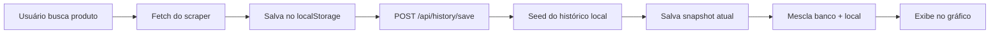
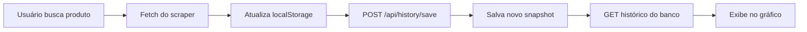
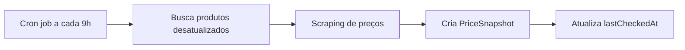
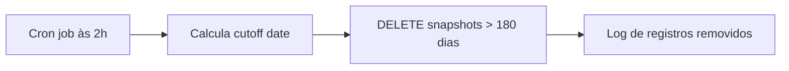

# Sistema de Histórico de Preços

## Visão Geral

O Price Watcher implementa um sistema robusto de armazenamento e visualização de histórico de preços com as seguintes características:

- **Armazenamento no Banco de Dados**: Todos os preços são salvos no PostgreSQL
- **Histórico Limitado a 180 Dias**: Limpeza automática de dados antigos
- **Seed de Histórico Local**: Migração automática do localStorage para o banco
- **Filtros de Período**: Visualização customizada (Hoje, 3 dias, 1 semana, 1 mês, 3 meses, 6 meses)
- **Cache Compartilhado**: Todos os usuários se beneficiam do histórico coletado

## Arquitetura

### 1. Modelo de Dados (Prisma)

```prisma
model PriceSnapshot {
  id                String   @id @default(cuid())
  productId         String
  product           Product  @relation(fields: [productId], references: [id], onDelete: Cascade)

  timestamp         DateTime @default(now())

  priceVista        Float?
  priceParcelado    Float?
  priceOriginal     Float?

  installmentsCount Int?
  installmentsValue Float?

  source            String   @default("scheduled") // 'manual', 'scheduled', 'auto'

  @@index([productId, timestamp])
  @@index([timestamp])
}
```

### 2. APIs

#### POST /api/history/save
Salva um snapshot de preço e faz seed do histórico local.

**Request Body:**
```json
{
  "sessionId": "uuid",
  "productId": "922662",
  "provider": "kabum",
  "priceVista": 1299.99,
  "priceParcelado": 1399.99,
  "priceOriginal": 1599.99,
  "installmentsCount": 12,
  "installmentsValue": 116.66,
  "source": "manual",
  "localHistory": [
    {
      "timestamp": 1704067200000,
      "priceVista": 1250.00,
      "priceParcelado": 1350.00,
      "priceOriginal": 1550.00
    }
  ]
}
```

#### GET /api/history?sessionId={id}&productId={id}&provider={provider}&period={period}
Busca histórico filtrado por período.

**Query Params:**
- `sessionId`: ID da sessão do usuário
- `productId`: ID do produto (KaBuM/Amazon)
- `provider`: Provider do produto (kabum/amazon)
- `period`: Período do filtro (today|3days|1week|1month|3months|6months)

**Response:**
```json
{
  "history": [
    {
      "timestamp": 1704067200000,
      "priceVista": 1299.99,
      "priceParcelado": 1399.99,
      "priceOriginal": 1599.99
    }
  ]
}
```

### 3. Componentes

#### PeriodFilter
Componente de filtro de período com botões para seleção:
- Hoje
- 3 dias
- 1 semana
- 1 mês
- 3 meses
- 6 meses (padrão)

#### HistoryChart
Gráfico de linha com filtro de período integrado. Mostra:
- Preço à vista (PIX)
- Preço parcelado (total)
- Preço original (quando disponível)

#### CompareChart
Gráfico comparativo com filtro de período. Permite comparar múltiplos produtos no mesmo período.

### 4. Helpers (src/lib/price-history.ts)

#### savePriceSnapshot()
Salva um snapshot de preço no banco de dados.

#### getPriceHistory()
Busca histórico filtrado por período.

#### mergeHistoryWithDatabase()
Mescla histórico do localStorage com histórico do banco, priorizando dados do banco.

#### seedPriceHistoryFromLocal()
Migra dados do localStorage para o banco de dados, evitando duplicatas.

## Fluxo de Dados

### 1. Primeira Busca de Produto



### 2. Buscas Subsequentes



### 3. Atualização Automática (Cron)



### 4. Limpeza de Dados (Cron)



## Cron Jobs

### 1. Update Prices (09:00 diariamente)
- **Path**: `/api/cron/update-prices`
- **Schedule**: `0 9 * * *` (1x por dia às 09:00)
- **Função**: Atualiza preços de TODOS os produtos favoritos
- **Filtro**: Produtos não atualizados nas últimas 24 horas
- **Fonte**: `scheduled`
- **Nota**: Plano Hobby da Vercel permite apenas execuções diárias

### 2. Cleanup Old Prices (02:00 diariamente)
- **Path**: `/api/cron/cleanup-old-prices`
- **Schedule**: `0 2 * * *` (1x por dia às 02:00)
- **Função**: Remove snapshots com mais de 180 dias
- **Retenção**: Exatamente 180 dias de histórico

## Cache Inteligente (TTL de 60 minutos)

Além do cron diário, o sistema implementa um **cache colaborativo** entre usuários:

### Como Funciona:

```
10:00 - Usuário A busca produto X → Scraping + Salva no cache
10:30 - Usuário B busca produto X → Usa cache (ainda válido)
10:59 - Usuário C busca produto X → Usa cache (ainda válido)
11:05 - Usuário D busca produto X → Novo scraping (cache expirou após 60min)
```

### Benefícios:

- ✅ Preços atualizados a cada hora (no máximo)
- ✅ Reduz carga nos servidores das lojas
- ✅ Melhora performance para todos os usuários
- ✅ Economia de recursos (menos scraping desnecessário)

## Filtros de Período

| Período | Dias | Milissegundos |
|---------|------|---------------|
| Hoje | 0 | Desde 00:00 do dia atual |
| 3 dias | 3 | `3 * 24 * 60 * 60 * 1000` |
| 1 semana | 7 | `7 * 24 * 60 * 60 * 1000` |
| 1 mês | 30 | `30 * 24 * 60 * 60 * 1000` |
| 3 meses | 90 | `90 * 24 * 60 * 60 * 1000` |
| 6 meses | 180 | `180 * 24 * 60 * 60 * 1000` |

## Vantagens do Sistema

1. **Histórico Persistente**: Dados não são perdidos ao limpar o navegador
2. **Sincronização Multi-dispositivo**: Mesmo histórico em todos os dispositivos do usuário
3. **Cache Compartilhado**: Usuários se beneficiam de buscas anteriores de outros usuários
4. **Otimização de Performance**: Filtros aplicados no cliente reduzem tráfego de rede
5. **Escalabilidade**: Limpeza automática mantém o banco limpo e performático
6. **Migração Transparente**: Seed automático do localStorage para o banco
7. **Fallback Robusto**: Se o banco falhar, usa localStorage como backup

## Configuração

### Variáveis de Ambiente

Adicione no `.env.local`:

```bash
# Cron Secret (gere um UUID aleatório)
CRON_SECRET=seu-uuid-secreto-aqui
```

### Deploy na Vercel

1. Configure a variável de ambiente `CRON_SECRET` no dashboard da Vercel
2. O `vercel.json` já está configurado com os cron jobs
3. Os cron jobs são executados automaticamente após o deploy

## Monitoramento

### Logs de Cron Jobs

Verifique os logs na Vercel:
- Dashboard → Seu projeto → Functions → Cron Jobs

### Verificação de Dados

```sql
-- Total de snapshots por produto
SELECT productId, COUNT(*) as total
FROM "PriceSnapshot"
GROUP BY productId
ORDER BY total DESC;

-- Snapshots mais antigos
SELECT MIN(timestamp) as oldest, MAX(timestamp) as newest
FROM "PriceSnapshot";

-- Snapshots por fonte
SELECT source, COUNT(*) as total
FROM "PriceSnapshot"
GROUP BY source;
```

## Troubleshooting

### Histórico não aparece no gráfico

1. Verifique se o produto foi salvo no banco
2. Verifique se há snapshots para o período selecionado
3. Verifique o console do navegador para erros de API

### Cron jobs não executam

1. Verifique se `CRON_SECRET` está configurado
2. Verifique os logs de função na Vercel
3. Teste manualmente com curl:

```bash
curl -X GET https://seu-app.vercel.app/api/cron/update-prices \
  -H "Authorization: Bearer seu-cron-secret"
```

### Dados antigos não são removidos

1. Verifique se o cron de cleanup está executando
2. Verifique os logs do cron job
3. Execute manualmente para testar

## Próximos Passos

- [ ] Adicionar notificações de queda de preço
- [ ] Implementar análise de tendências (previsão de preços)
- [ ] Adicionar export de histórico em CSV/Excel
- [ ] Implementar comparação de períodos (ex: mês atual vs mês anterior)
- [ ] Adicionar métricas de volatilidade de preços
